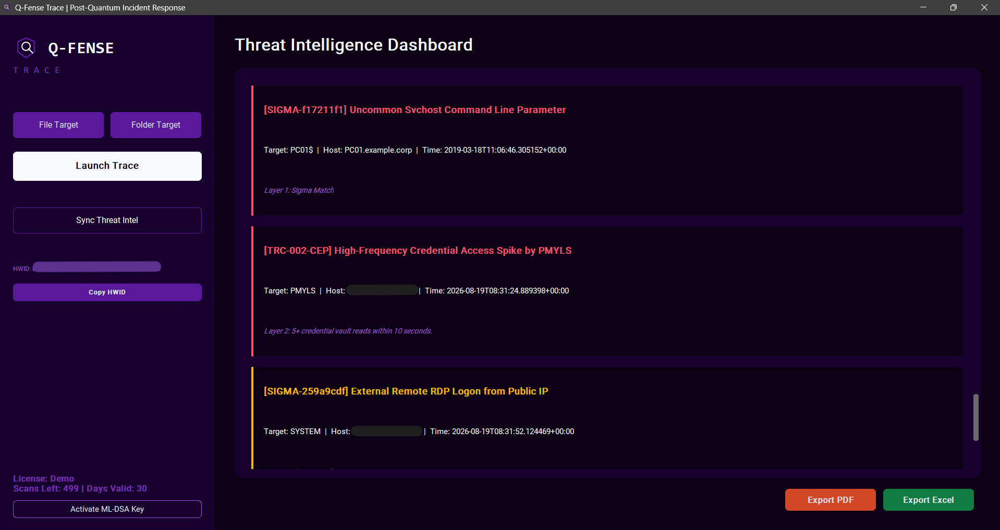
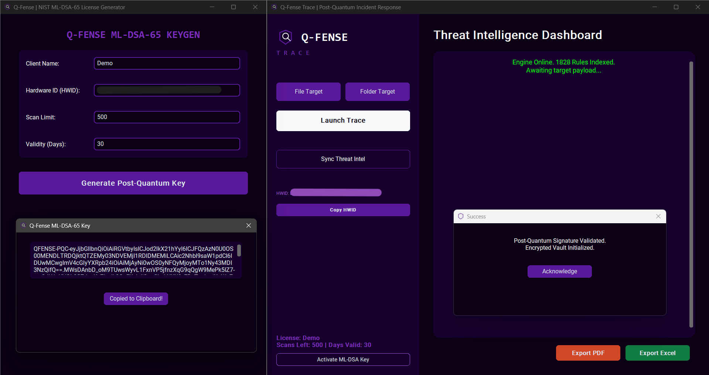
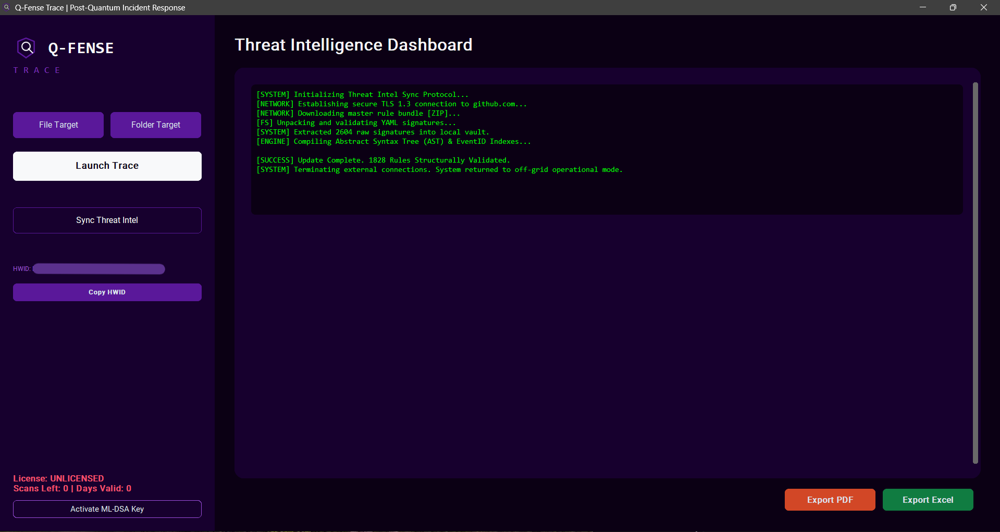
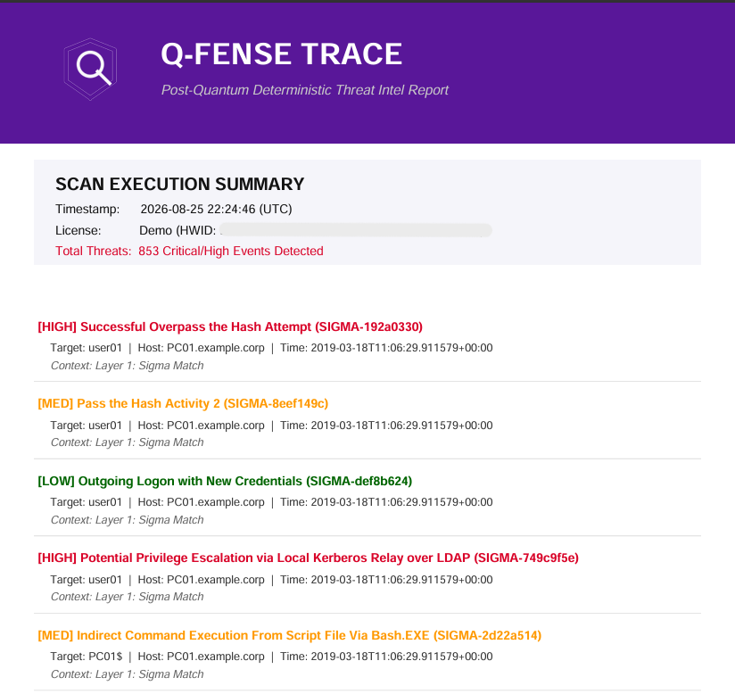

# QFense Trace: Offline Post-Quantum Threat Hunting & EVTX Forensic Engine

[](#licensing)
[](#cryptographic-architecture)
[](#platform-support)
[](#architecture)

**QFense Trace** is a deterministic, offline-first cybersecurity event-log analysis engine designed for air-gapped incident response, forensic triage, and DFIR investigations. It processes raw Windows Event Logs (`.evtx`) locally at high speed without relying on cloud infrastructure.

---

## 📸 Interface & Capabilities

### 1. Dual-Layer Threat Intelligence Dashboard
Correlates raw Windows Event Logs against thousands of Sigma signatures and stateful behavioural heuristics simultaneously.


### 2. Post-Quantum Cryptographic Licensing (NIST ML-DSA-65)
Licensing payloads are signed using lattice-based digital signatures (FIPS 204), ensuring cryptographic integrity against quantum cryptanalysis.


### 3. Real-Time Threat Intel Synchronization & AST Compilation
Extracts, validates, and indexes threat signatures into memory with indexed EventID routing for rapid execution.


### 4. Forensic PDF & Excel Deliverables
Compiles forensic matches into executive PDF threat summaries and structured multi-sheet Excel workbooks.


---

## 🛡️ Core Architecture

  ## Architecture

```text
                                                ┌──────────────────────────────┐
                                                │       Windows EVTX Logs      │
                                                │      (File / Folder)         │
                                                └──────────────┬───────────────┘
                                                               │
                                                               ▼
                                                ┌──────────────────────────────┐
                                                │     Rust PyEvtxParser        │
                                                │          Stream              │
                                                └──────────────┬───────────────┘
                                                               │
                                                               ▼
                                                ┌──────────────────────────────┐
                                                │      Unified Event Schema    │
                                                │     (NormalizedEvent)        │
                                                └──────────────┬───────────────┘
                                                               │
                                              ┌────────────────┴──────────────────────┐
                                              ▼                                       ▼
                                ┌────────────────────────────────┐    ┌────────────────────────────────┐
                                │ Layer 1: Sigma Matcher         │    │ Layer 2: Stateful CEP          │
                                │                                │    │                                │
                                │ • AST-compiled conditions      │    │ • Sliding time windows         │
                                │ • EventID routing              │    │ • Attack sequences             │
                                │ • Multi-folder rule bundles    │    │ • Memory-bounded               │
                                │                                │    │                                │
                                │                                │    │                                │
                                └────────────────┬───────────────┘    └─────────────────┬──────────────┘
                                                 │                                      │
                                                 └──────────────────┬───────────────────┘
                                                                    ▼
                                                       ┌─────────────────────────┐
                                                       │   Alert / Evidence      │
                                                       │          Queue          │
                                                       └────────────┬────────────┘
                                                                    │
                                                           ┌────────┴────────┐
                                                           ▼                 ▼
                                                ┌──────────────────────┐  ┌──────────────────────┐
                                                │   CustomTkinter GUI  │  │ Forensic Export      │
                                                │                      │  │ Engine               │
                                                │ • Live threat cards  │  │                      │
                                                │ • Virtualized memory │  │ • Executive PDF      │
                                                │   caps               │  │   summary            │
                                                │                      │  │ • Structured Excel   │
                                                │                      │  │   logs               │
                                                └──────────────────────┘  └──────────────────────┘
```


### 1. Event Normalization Pipeline
* Implements a strict `NormalizedEvent` data model extracting standard Windows identities (`SubjectUserName`, `TargetUserName`, `Domain`), network metadata (`SourceIp`, `DestinationIp`, `Ports`), process telemetry (`CommandLine`, `ParentProcessName`, `ProcessId`), and security descriptor handles.
* Streams EVTX records lazily with built-in header validation to protect against malformed or truncated log files.

### 2. Layer 1: Indexed Sigma Matcher
* Bypasses the $O(N \times M)$ evaluation bottleneck via **EventID Hash Indexing**, evaluating only candidate rules relevant to the target event taxonomy.
* Dynamically parses Sigma YAML detection blocks into an Abstract Syntax Tree (AST), supporting scalar matching, wildcard expressions, list expansions, and logical combinators.
* Supports dual-directory rule ingestion (`rules/` and `custom_rules/`) to isolate threat-intel updates from proprietary rules.

### 3. Layer 2: Stateful Complex Event Processor (CEP)
* Evaluates multi-event attack sequences across temporal sliding windows (e.g., detecting high-frequency DPAPI credential vault access spikes).
* Enforces hard memory boundaries (10,000 events/user cap) and atomic suppression/cooldown windows to prevent alert fatigue and memory exhaustion.

### 4. Post-Quantum Licensing Subsystem
* License generation and verification are decoupled using **NIST ML-DSA-65 (FIPS 204)** lattice-based cryptography.
* Public verification keys are embedded directly in client builds; private signing keys remain exclusively on offline developer infrastructure.
* Local state and scan counters are encrypted using machine-bound symmetric vaults tied to hardware identifiers (HWID) with clock-tamper protection.

---

## 🚀 Quick Start (Evaluation Mode)

1. **Download:** Grab the latest `QFense-Trace-Win64.zip` from the [Releases](https://github.com/YOUR_USERNAME/qfense-trace/releases) tab.
2. **Extract:** Unzip the archive to any directory on a 64-bit Windows machine (no Python or compiler installation required).
3. **Obtain HWID:** Launch `app.exe` and click **Copy HWID** on the left sidebar.
4. **Request Key:** Send your HWID to the developer via [LinkedIn](https://www.linkedin.com/in/YOUR_PROFILE_LINK) to receive your signed evaluation license.
5. **Activate:** Click **Activate ML-DSA Key**, paste the license string, and begin scanning logs immediately. Test samples are provided in the included `samples/` directory.

---

## 📊 Verification & Forensic Test Samples

The engine has been verified against standard MITRE ATT&CK telemetry sets:
* **Credential Access:** `sysmon_10_11_lsass_memdump.evtx` (LSASS Process Injection)
* **Lateral Movement:** `LM_4624_mimikatz_sekurlsa_pth_source.evtx` (Pass-the-Hash over SMB)
* **Persistence & Execution:** `sysmon_13_keylogger_directx.evtx` (DirectInput API Hooking)

---

## 💼 Commercial Inquiries & Pilots

QFense Trace is available for enterprise evaluation, DFIR team deployment, and MSSP integration.

* **Developer:** Abdullah Nadeem
* **Specialization:** Post-Quantum Cryptography & Deterministic Threat Detection
* **Direct Contact:** [LinkedIn Profile](https://www.linkedin.com/in/abdullah-nadeem-b4bba920a/)

---

## ⚖️ License & Terms

The executable distributions and proprietary CEP detection logic are provided under a commercial evaluation license. All rights reserved. Threat detection signatures from SigmaHQ are distributed under their respective open-source licenses.
